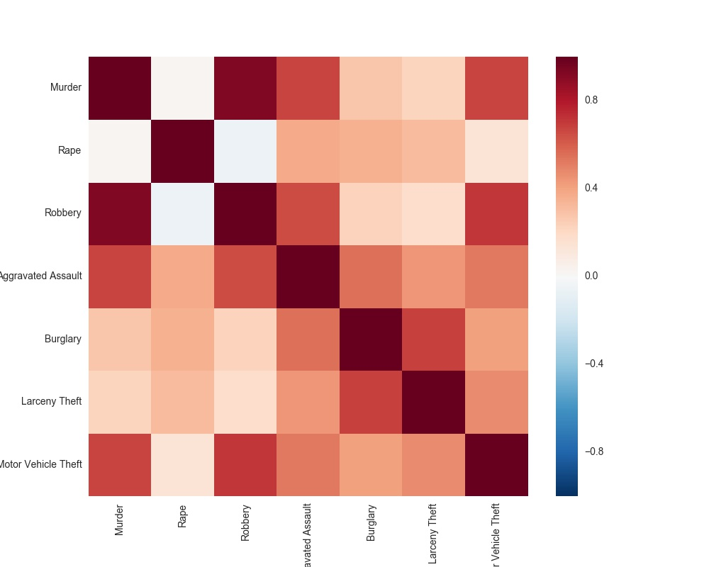
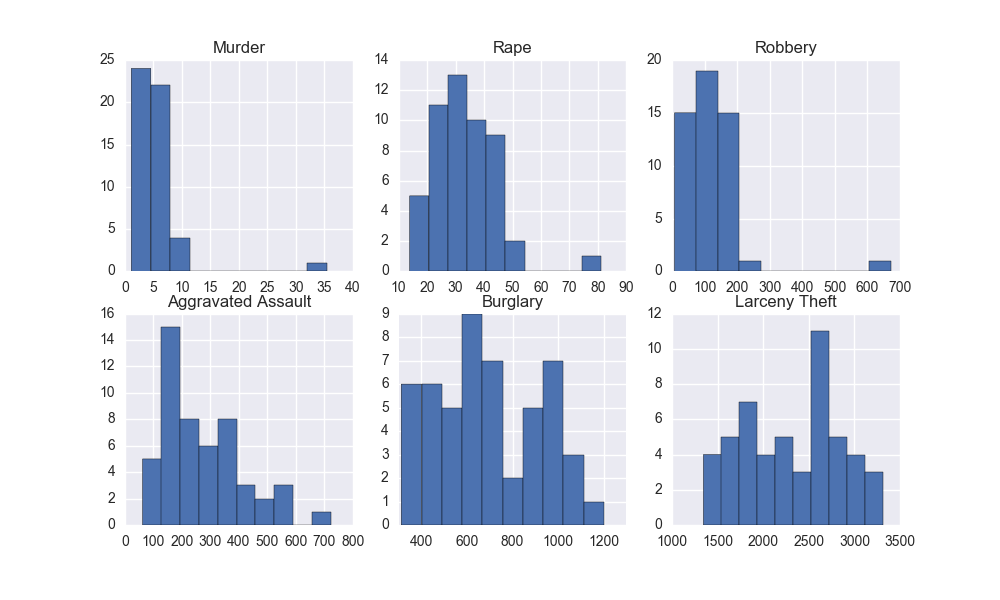
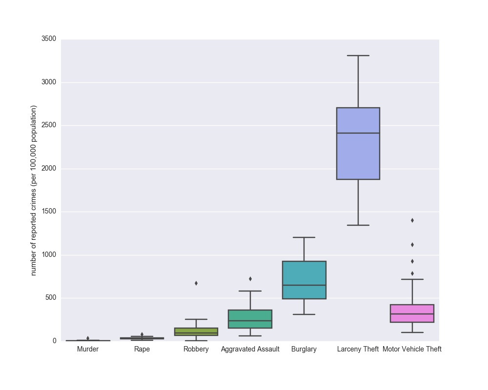
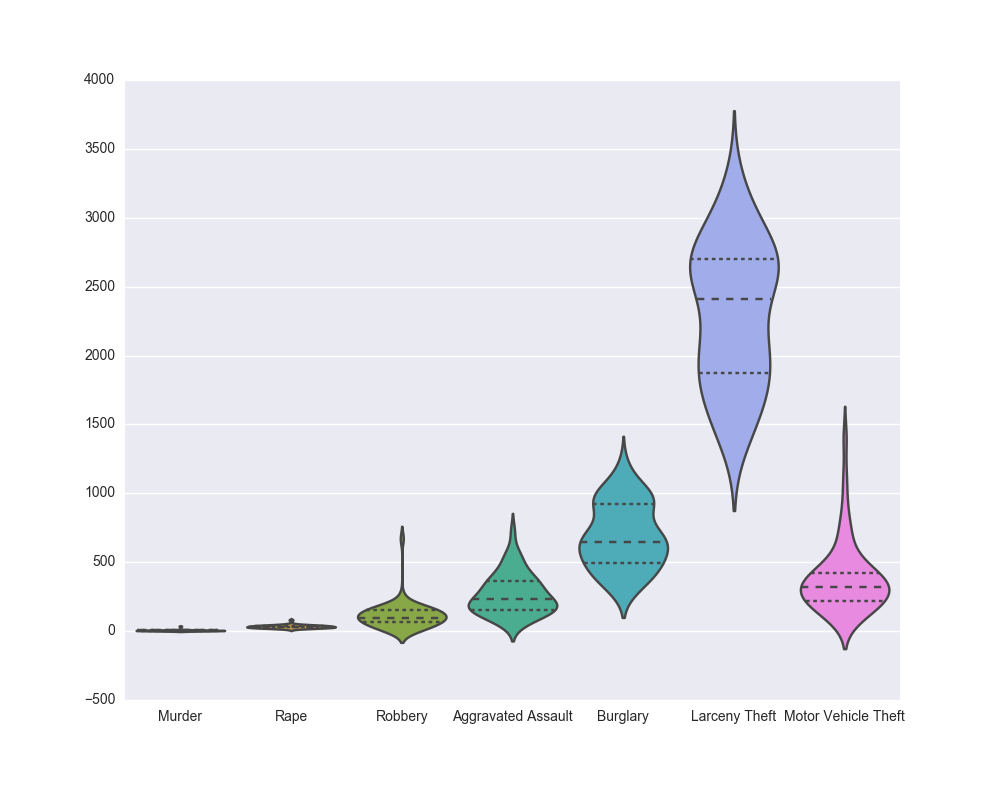
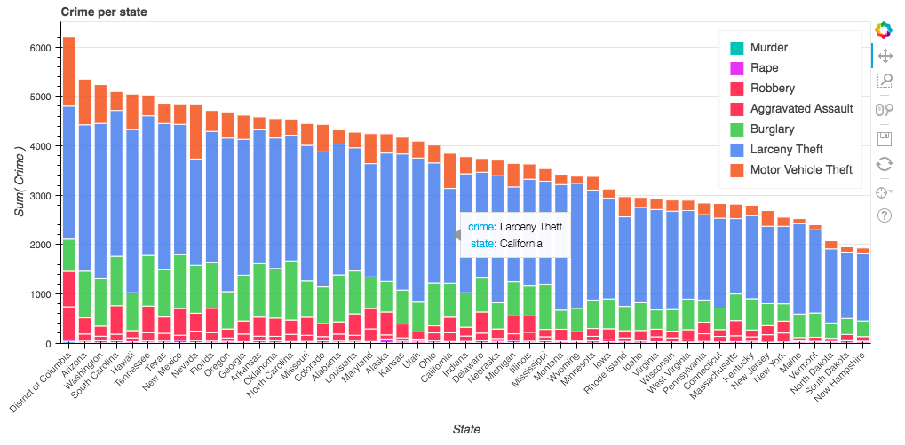
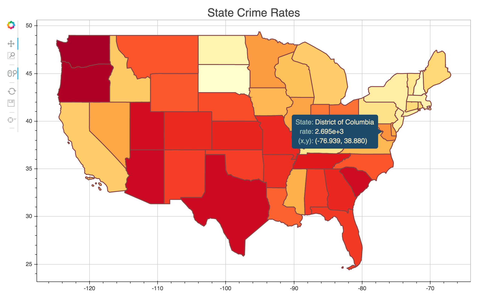

# DataViz
This code is to perform exploratory and explanatory data analysis on a crime data using Matplotlib, Seaborn and Bokeh (a web based Python interactive data visualization).  
The crime data represents the number of reported crimes (per 100,000 population) across seven categories of crimes for each state in the US, data originally from InfoChimps.

|State|Murder|Rape|Robbery|Aggravated Assault|Burglary|Larceny Theft|Motor Vehicle Theft|
|:--:|:--:|:--:|:--:|:--:|:--:|:--:|:--:|:--:|
|Alabama |8.2|34.3|141.4|247.8|953.8|2650|288.3|
|Alaska |4.8|81.1|80.9|465.1|622.5|2599.1|391|
|...|...|...|...|...|...|...|...|...|

## EDA:
* Heatmap of correlations

* Histogram for each crimes

* Box plot and Violin plot

## Explanatory Data Visulization
* Stacked bar chart  
This plots the [crime rates for each state](images/crime_per_state_stacked_bar_chart.html)

* Maps: [map of crime rate across US states](images/map_crime.html)

